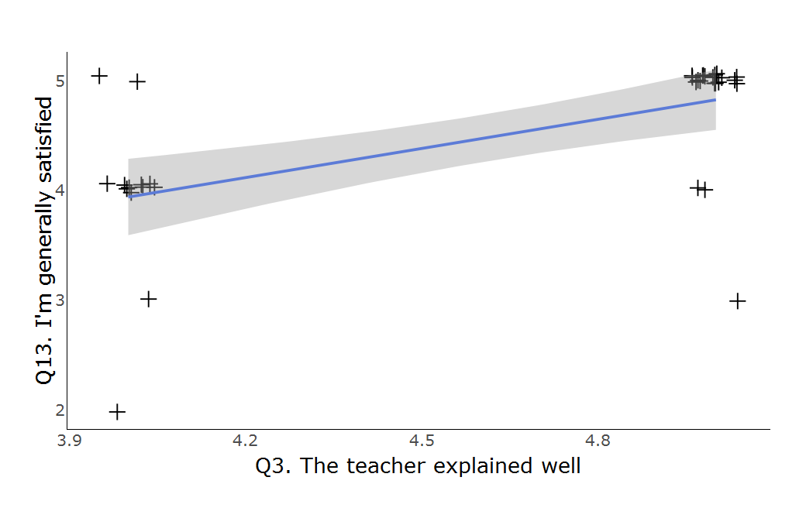

# Analyse
Makowski, D. & École de Neuropsychologie  


This report contains the full statistical analysis. 

# Descriptive Statistics


```r
library(knitr)
library(neuropsychology)
library(tidyverse)
library(plotly)

df <- read.csv("df.csv")
```

L'échantillon se compose de 34 étudiants.

# Global Satisfaction


```r
library(broom)

vars <- df %>% 
  select(starts_with("Q"))

fit <- lm(Q13_Satisfaction ~ ., data=vars)

summary(fit)
```

```
## 
## Call:
## lm(formula = Q13_Satisfaction ~ ., data = vars)
## 
## Residuals:
##      Min       1Q   Median       3Q      Max 
## -1.17857 -0.24811  0.07223  0.25658  1.05433 
## 
## Coefficients:
##                        Estimate Std. Error t value Pr(>|t|)  
## (Intercept)            -0.44809    2.00625  -0.223    0.826  
## Q1_Difficulty           0.29920    0.18205   1.644    0.116  
## Q2_Interest             0.27698    0.17173   1.613    0.122  
## Q3_Teaching             0.71529    0.34447   2.077    0.051 .
## Q4_Interest_Generation -0.04100    0.30156  -0.136    0.893  
## Q5_Speech_Unclarity    -0.03344    0.12728  -0.263    0.795  
## Q6_Adaptation           0.22987    0.18776   1.224    0.235  
## Q7_Examination          0.10200    0.19457   0.524    0.606  
## Q8_Mastery             -0.12257    0.26773  -0.458    0.652  
## Q9_Motivation          -0.02662    0.22447  -0.119    0.907  
## Q10_Methods            -0.36966    0.27904  -1.325    0.200  
## Q11_Interactivity      -0.06935    0.20123  -0.345    0.734  
## Q12_Availability        0.34848    0.27598   1.263    0.221  
## ---
## Signif. codes:  0 '***' 0.001 '**' 0.01 '*' 0.05 '.' 0.1 ' ' 1
## 
## Residual standard error: 0.608 on 20 degrees of freedom
##   (1 observation deleted due to missingness)
## Multiple R-squared:  0.5934,	Adjusted R-squared:  0.3495 
## F-statistic: 2.432 on 12 and 20 DF,  p-value: 0.03806
```


```r
plot <- df %>% 
  ggplot(aes(y=Q13_Satisfaction, x=Q3_Teaching)) +
  geom_jitter(width=0.05, height=0.05, size=4, shape="+") +
  geom_smooth(method="lm", fullrange=T) +
  theme_neuropsychology() +
  xlab("\nQ3. The teacher explained well") +
  ylab("Q13. I'm generally satisfied\n")
ggplotly(plot)
```

<!-- -->

# Factor Analysis


```r
library(FactoMineR)
library(factoextra)

# vars <- df %>% 
#   select(starts_with("Q")) %>% 
#   select(-starts_with("Q13"))
# 
# pca <- PCA(df)
# get_eig(res.pca)
# fviz_screeplot(res.pca, addlabels = TRUE, ylim = c(0, 50))
```

